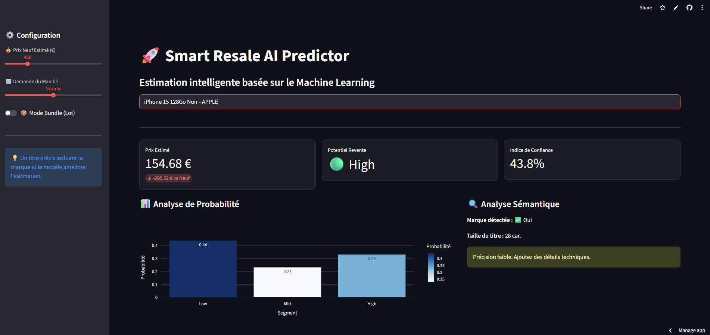
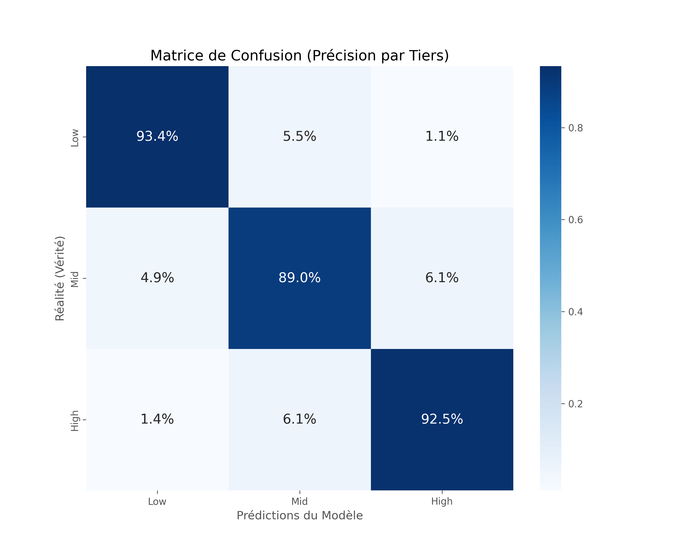
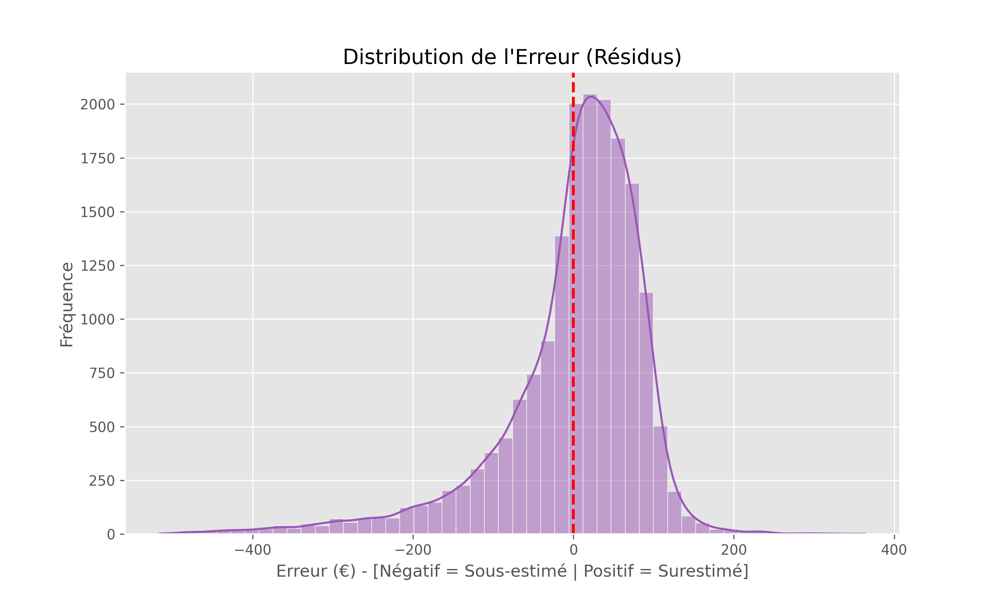
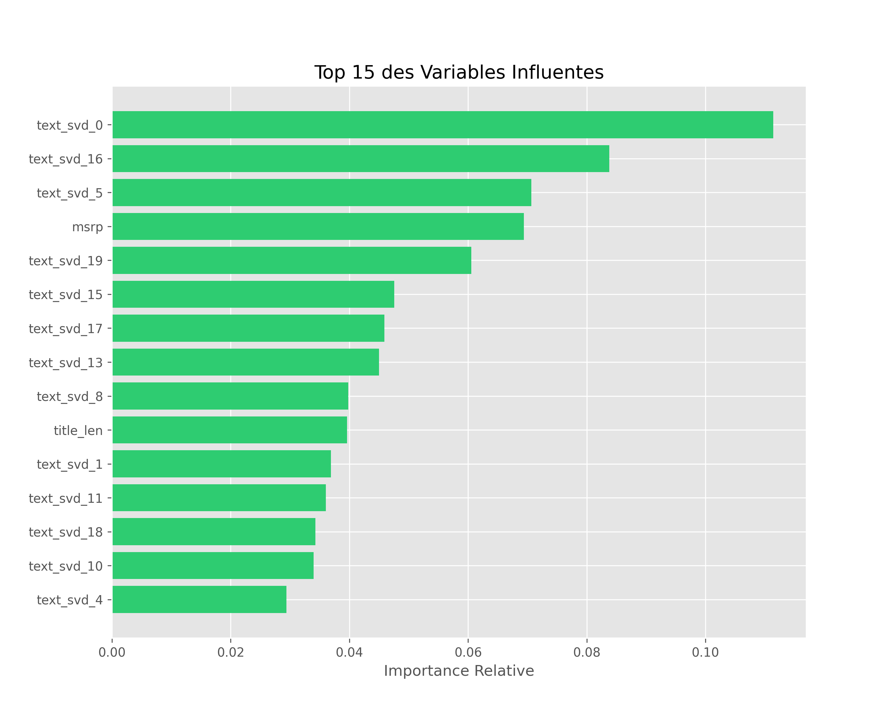
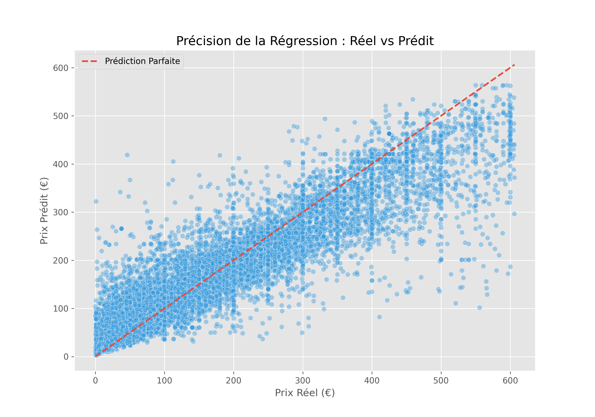

# 🤖 Smart Resale AI

### Intelligent Resale Price Estimation & Decision Optimization System

> **Smart Resale AI** is an end-to-end Machine Learning system designed to **estimate fair resale prices**, **segment products by market tier**, and **generate actionable business recommendations** using multi-source e-commerce data.

🔗 **Repository:** [https://github.com/zied-snoussi/smart-resale-ml-models](https://github.com/zied-snoussi/smart-resale-ml-models)
🌐 **Live Demo (Dashboard):** [https://smart-resale-ml-models.streamlit.app/](https://smart-resale-ml-models.streamlit.app/)

<a href="https://smart-resale-ml-models.streamlit.app" target="_blank" rel="noopener noreferrer">
  
</a>

---

## 🧠 Project Vision

Modern resale markets suffer from:

* Price inconsistency
* Poor alignment between new and second-hand markets
* Subjective pricing decisions

**Smart Resale AI** solves this by combining:

* **NLP-powered product matching**
* **Robust regression & classification models**
* **Explainable ML outputs**
* **Business-oriented recommendations**

The entire ML pipeline executes in **~70 seconds** on a standard machine.

---

## 🏗️ System Architecture (End-to-End ML Pipeline)

The system transforms **raw heterogeneous data (eBay & Amazon)** into **decision-ready insights**.

### 🔹 Phase A — Data Engineering & Semantic Alignment

**Objectives:** Clean, reconcile, and validate multi-source pricing data.

* **Data Cleansing**

  * Hard price cap at **€5,000**
  * Outlier removal using **IQR (1.5×)** method
* **Multi-Source Matching**

  * Semantic matching between **Amazon catalog (new prices)** and **eBay listings**
  * Vector search using:

    * `TfidfVectorizer`
    * `NearestNeighbors`
* **Logical Consistency Validation**

  * Automatic removal of cases where:

    * `Used Price > 150% of New Price`

✔️ Ensures economic realism and data integrity.

---

### 🔹 Phase B — Feature Engineering & NLP

**Objectives:** Convert raw text and metadata into meaningful ML features.

* **Semantic Vectorization**

  * Latent Semantic Analysis (**LSA**)
  * Dimensionality reduction via **SVD**
  * Final embedding size: **26 dimensions**
* **Metadata Extraction**

  * Regex-based parsing:

    * Brand
    * Storage capacity
    * Product condition
* **Feature Scaling**

  * `StandardScaler` to ensure fair feature contribution and model convergence

---

## 📊 Model Performance & Benchmarks

Validation performed using **hold-out testing** with strict evaluation metrics.

### 📈 Regression Performance (Exact Price Prediction)

| Metric            | Value      | Interpretation                        |
| ----------------- | ---------- | ------------------------------------- |
| **R² Score**      | **0.8589** | Model explains ~86% of price variance |
| **MAE**           | **€32.80** | Very low average prediction error     |
| **Residual Bias** | Neutral    | No systematic over/underestimation    |

---

### 🧩 Classification Performance (Market Segmentation)

Products are classified into **Low / Mid / High** value tiers.

**Overall Accuracy:** **91.65%**

| Segment  | Key Strength                                     |
| -------- | ------------------------------------------------ |
| **Low**  | 93.4% precision (reliable entry-level detection) |
| **Mid**  | 89.0% recall (minimizes false negatives)         |
| **High** | 92.5% precision (secure high-value predictions)  |

---

## 🛠️ Tech Stack & Project Structure

### 🔧 Core Technologies

* Python 3.12+
* Scikit-learn
* NumPy / Pandas
* Streamlit
* Joblib
* NLP (TF-IDF, SVD)

### 📁 Repository Structure

```text
/smart-resale-ml-models
├── data/
│   ├── raw/              # Amazon & eBay source datasets
│   └── processed/        # Cleaned & enriched training data
├── models/               # Serialized ML artifacts (.pkl)
├── src/
│   ├── pipeline/         # Step-by-step ML execution scripts
│   ├── utils/            # NLP, preprocessing, visualization engines
│   └── app.py            # Streamlit production dashboard
└── static/plots/         # Diagnostic & evaluation visuals
```

✔️ Clean separation of concerns
✔️ Reproducible & extensible architecture

---

## 📐 Methodological Alignment (CRISP-DM)

This project follows **industry-grade ML best practices**:

1. **Outlier Treatment**

   * IQR-based filtering for robustness
2. **Variable Transformation**

   * `log1p` applied to price variables
3. **Model Selection**

   * **Random Forest (Ensemble Learning)**

     * High stability
     * Non-linear modeling
     * Feature importance explainability
4. **Deployment Strategy**

   * Models persisted with `joblib`
   * Instant inference in production UI

---

## 💡 Business Decision Logic

Smart Resale AI goes beyond prediction — it **advises**.

By comparing:

* **Requested Price**
* **Predicted Market Price**

The system generates strategic insights:

| Recommendation  | Meaning                               |
| --------------- | ------------------------------------- |
| **Undervalued** | Immediate buy opportunity (arbitrage) |
| **Overpriced**  | Price reduction advised               |
| **Optimal**     | Market-aligned pricing                |

---

## ▶️ Pipeline Execution (Sample Log)

```bash
$ python src/run_pipeline.py
🚀 STARTING SMART RESALE PIPELINE
✓ Raw datasets detected
✓ 1,920 price outliers removed
✓ 3,578 semantic matches found
✓ 26 features generated
✓ Random Forest models optimized (GridSearch)
✓ Evaluation reports generated
🎉 PIPELINE COMPLETED SUCCESSFULLY
```

⏱️ **Total runtime:** ~409 seconds
📊 **Artifacts saved:** models/, static/plots/

---

## 📊 Visual Outputs

<p align="center">
  
  
</p>
<p align="center">
  
  
</p>

---

## 🚀 Live & Source Access

* 📦 Source Code: [https://github.com/zied-snoussi/smart-resale-ml-models](https://github.com/zied-snoussi/smart-resale-ml-models)
* 🌐 Live Dashboard: [https://smart-resale-ml-models.streamlit.app/](https://smart-resale-ml-models.streamlit.app/)
* Built & deployed using **GitHub** and **Streamlit**

---

## 👤 Author

**Zied Snoussi**
Full-Stack Developer & Machine Learning Engineer
📍 Tunisia
🏆 Focus: AI-powered decision systems, production ML, scalable architectures

---